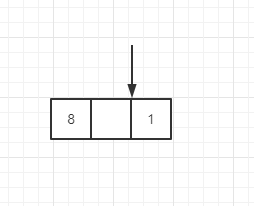

# 位置匹配


|  锚   | 位置  |
|  ----  | ----  |
| `^`  | 开头，多行的每一行开头 |
| `$`  | 结尾，多行的每一行结尾 |
| `\b`  | 单词边界：[_0-9a-zA-Z] 和 非 [_0-9a-zA-Z] 之间的位置 |
| `\B`  | 排除 \b 匹配的位置后剩下的位置 |
| `(?=p)`  | 正向先行断言：p 前面的位置 |
| `(?!p)`  | 负向先行断言：不是 p 前面的位置 |


## 一、`^` 和 `$`

`^` 在正则表达式中有两种用法：

- 字符组中使用   
  表示排除某些字符
- 非字符组中使用   
  表示位置匹配


## 二、`\b` 和 `\B`

谨慎使用 `\b` 和 `\B`，通常字符串中会匹配到多个单词边界。

给定字符串 "1678 123789"

要求匹配间隔的位置，如下图所示：



这里就比较适合使用 `\b` 来匹配了，下图是全局匹配的结果：


## 三、`(?=p)` 和 `(?!p)`

这里的问题是，每次看完先行断言的知识点，很快就忘记了。
建议通过一些例子来熟悉先行断言的用法。


## 四、位置的特性

可以把位置理解成空字符 `""`

**注意**：
是空字符，不是空格，两者的含义是不一样的。 

## 五、数字的千位分隔符表示法

把 "12345678", 变成"12,345,678"

#### 5.1 最后一个逗号

找出最后一个逗号的位置：

最后一个逗号的位置，后面应该是3个数字，最后是末尾。

即：子模式应该是 `\d{3}$`

:candy:
```js
let str = "12345678";
let regex = /(?=\d{3}$)/g;
let result = str.replace(regex, ',');
console.log(result);
// => "12345,678"
```

#### 5.2 找出剩下的逗号

最后一个逗号的位置：后面应该是3个数字，最后是末尾。

可以用最笨的方式找规律：
倒数第二个逗号的位置：后面应该是6个数字，最后是末尾。
倒数第三个逗号的位置：后面应该是9个数字，最后是末尾。

可以发现通用的规律是：
每个逗号的位置：后面应该是 `n * 3` 个数字，最后是末尾。

因为 `n >= 1`, 所以可以使用量词 `+`

即：`(\d{3})+$`

:candy:
```js
let str = "12345678";
let regex = /(?=(\d{3})+$)/g;
let result = str.replace(regex, ',');
console.log(result);
// => "12,345,678"
```

**附加说明**

一个疑惑：逗号是怎么添加到字符串当中的，replace() 方法是怎么添加逗号的？(js 基础有待加强:sob:)

- 猜想1：~~找到所有的位置之后，再添加逗号~~:x:
- 猜想2：找到一个位置，添加逗号，在此基础上继续找下一个逗号:question:

这里猜想2是有歧义的：

- 理解方式1：~~针对原字符串，根据正则找到一个位置，在原字符串中添加逗号，然后针对原字符串继续找下一个逗号~~:x:
- 理解方式2：针对原字符串，根据正则找到一个位置，在新字符串中添加逗号，然后针对原字符串继续找下一个逗号

理解方式1是错误的，因为 `replace()` 方法是不会改变原字符串的。

所有的逗号都是在新的字符串上面添加，而根据正则表达式找位置，是针对于原字符串的，这点一定要想清楚。

完整的描述是：

针对原字符串，倒数第二个逗号的位置：后面应该是6个数字，最后是末尾。

#### 5.3 边界处理

刚才是从后往前找，但是这里有个容易被忽略的限制条件：

**逗号的位置不能是开头**

:candy: 没考虑边界时
```js
let str = "123456789";
let regex = /(?=(\d{3})+$)/g;
let result = str.replace(regex, ',');
console.log(result);
// => ",123,456,789"
```

这里就用到了负向先行断言

`(?=^)` 子模式是开头，匹配的就是开头前面的位置，但实际上可以认为就是开头，因为`开头`和`开头前面的位置` 代表的是同一个位置，想想位置的特性，2个空字符和1个空字符实际上所占得空间是一样的。

因为`(?=^)`匹配的是开头，那么`(?!^)`就代表不是开头的位置

:candy:
```js
let str = "123456789";
let regex = /(?!^)(?=(\d{3})+$)/g;
let result = str.replace(regex, ',');
console.log(result);
// => "123,456,789"
```